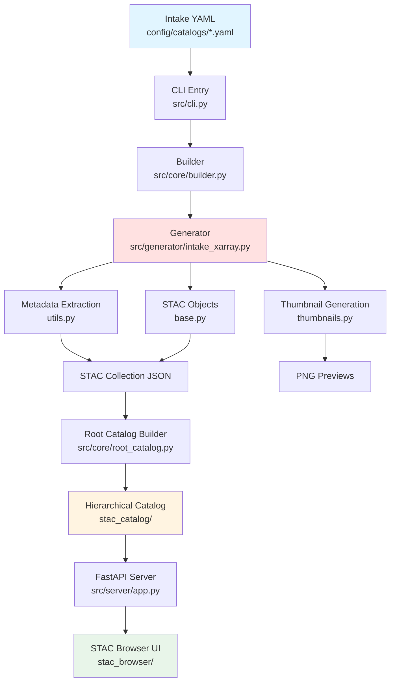

# NTU CompHydroMet Lab STAC Manager


A **production-grade, configuration-driven** pipeline for transforming scientific datasets (NetCDF, Zarr, GRIB) into compliant [SpatioTemporal Asset Catalog (STAC)](https://stacspec.org/) indexes. Built for research environments requiring reproducibility, scalability, and zero data duplication.

---

## Core Design Philosophy

This project is built on **three foundational strategies**:

### 1. **Static STAC** (Database-Free Architecture)
- Generates static JSON files instead of running a dynamic API server
- **Why?** Zero maintenance overhead, instant portability, CDN-ready deployment
- Perfect for datasets with batch update cycles (daily/monthly)

### 2. **Zero-Copy Data Access** (Virtual References)
- Uses symlinks and direct file paths instead of duplicating multi-TB datasets
- **Why?** Storage efficiency + instant "ingestion" (seconds vs. hours)
- Catalog always points to authoritative NAS sources

### 3. **Configuration as Code** (Intake-First)
- [Intake YAML](https://intake.readthedocs.io/) catalogs are the single source of truth
- **Why?** Version-controlled metadata, scientist-friendly editing, ecosystem compatibility
- Add datasets by editing YAML, not Python code

---

## System Architecture



### Directory Structure & Responsibilities

| Directory | Role | Description |
|:----------|:-----|:------------|
| **`config/`** | **Control Plane** | User-editable YAML configs. Defines datasets (`catalogs/`), server settings, and build targets (`main.yaml`). |
| **`src/cli.py`** | **Entry Point** | Typer-based CLI with commands: `build`, `serve`, `validate`. |
| **`src/core/`** | **Orchestration** | Parallel task scheduling (`builder.py`), catalog hierarchy management (`root_catalog.py`), and validation (`validator.py`). |
| **`src/generator/`** | **ETL Engine** | Converts Xarray datasets to STAC. Includes `intake_xarray.py` (driver), `utils.py` (geometry/extent), `thumbnails.py` (visualization), `base.py` (STAC object assembly). |
| **`src/server/`** | **Web Server** | FastAPI app serving static STAC catalog + browser UI. |
| **`src/settings.py`** | **Config Loader** | Pydantic models for `config/main.yaml` validation. |
| **`stac_catalog/`** | **Output** | Generated static STAC JSON files (gitignored, deployed separately). |
| **`stac_browser/`** | **UI Assets** | Pre-built Radiant Earth STAC Browser (static HTML/JS). |
| **`tests/`** | **Test Suite** | Unit tests and debug scripts. |

---

## Quick Start

### Prerequisites
- Python 3.8+
- [uv](https://github.com/astral-sh/uv) (recommended) or pip

### Installation

```bash
# Clone repository
git clone https://github.com/NTU-CompHydroMet-Lab/wangup-stac-manager.git
cd wangup-stac-manager

# Install dependencies
uv sync
```

#### STAC Browser Setup

We no longer ship a pre-built browser bundle. Clone and build it locally so you can wire it to your freshly generated catalog:

```bash
# Fetch and build STAC Browser locally
git clone https://github.com/radiantearth/stac-browser.git stac_browser
cd stac_browser
npm install

# Point the browser to the FastAPI-mounted catalog before building
cat <<'EOF' > public/config.js
window.STAC_BROWSER_CONFIG = {
  catalogUrl: "/stac/catalog.json",
  catalogTitle: "NTU CompHydroMet Lab Data Catalog"
};
EOF

# Ensure the runtime config loads before the Vue bundle
perl -0pi -e 's#<!-- <script defer="defer" src="/config.js"></script> -->#<script defer src="/config.js"></script>#' public/index.html

npm run build
cd ..
```

> After each build, confirm `stac_browser/dist/config.js` still contains `/stac/catalog.json`. If `npm run build` is executed without the steps above, the UI will default to the public demo catalog.

### Basic Usage

We provide a management script `start.sh` for common operations:

```bash
# Start Server (Background via tmux)
# Serves catalog at http://localhost:8001 (configurable in config/main.yaml)
./start.sh serve

# Clean & Rebuild (Recommended for production releases)
# Wipes stac_catalog/ and regenerates from scratch with parallel processing
./start.sh clean-build

# Build + Serve (One-step deployment)
# Runs clean-build, then starts server if successful
./start.sh build-serve

# Stop Background Server
./stop.sh
```

**Alternative: Direct CLI Usage**

```bash
# Build specific catalog
uv run src/cli.py build --catalog config/catalogs/himawari_intake_catalog.yaml

# Build all catalogs in parallel
uv run src/cli.py build --parallel

# Start server (foreground)
uv run src/cli.py serve --port 8001

# Validate generated catalog
uv run src/cli.py validate
```

---

## Adding a New Dataset

Follow this **4-step SOP**:

### Step 1: Create Intake YAML
Add a new file in `config/catalogs/my_dataset.yaml`:

```yaml
sources:
  my_dataset_v1:
    driver: zarr
    args:
      urlpath: "/nas/data/my_dataset.zarr"
    metadata:
      # Core Identity (Required)
      id: "my_dataset_v1"
      title: "My Dataset Version 1"
      description: "Detailed description here..."
      
      # Display & UI
      catalog_name: "my_project"  # Groups into stac_catalog/my_project/
      thumbnail_method: "event"   # Options: event, middle, max, mean
      thumbnail_time: "2023-09-03T00:00:00"  # For event-based
      
      # Scientific Context
      category: "MODEL"  # SATELLITE, REANALYSIS, MODEL, OBSERVATION
      processing_level: "Level 3"
      keywords: ["precipitation", "taiwan"]
      
      # Providers
      provider_name: "My Institution"
      provider_url: "https://example.org"
```

### Step 2: Register in Build Config
Edit `config/main.yaml`:

```yaml
build:
  targets:
    - catalog: "config/catalogs/my_dataset.yaml"
      sources: ["my_dataset_v1"]
```

### Step 3: Generate STAC
```bash
uv run src/cli.py build --catalog config/catalogs/my_dataset.yaml
```

### Step 4: Verify
Visit `http://localhost:8001` to browse your new dataset in the STAC Browser.

---

## Configuration Reference

### System Settings (`config/main.yaml`)

```yaml
filesystem:
  output_dir: "stac_catalog"  # Where STAC JSONs are saved
  static_dir: "stac_browser"  # UI assets location

server:
  host: "0.0.0.0"
  port: 8001

project:
  id: "ntu-comphydromet-catalog"
  title: "NTU CompHydroMet Lab Data Catalog"
  description: "Research datasets for hydrological modeling"
```

### Metadata Tiers (Intake YAML)

All datasets must include these **4 tiers**:

1. **Core Identity**: `id`, `title`, `description`
2. **Display & UI**: `catalog_name`, `thumbnail_method`, `keywords`
3. **Scientific Context**: `category`, `processing_level`, `platform`
4. **Providers**: `provider_name`, `provider_url`, `license`

See `config/catalogs/template/` for complete examples.

---

## Advanced Features

### Antimeridian Handling
The generator automatically detects Pacific-centered datasets (e.g., Himawari) and:
- Generates correct `bbox` with `West > East` (e.g., `[80, -60, -160, 60]`)
- Splits geometries into valid `MultiPolygon` using the `antimeridian` package
- Patches `cube:dimensions` to show unwrapped extents (e.g., `[80, 200]`)

### Parallel Processing
Build multiple datasets concurrently:

```bash
uv run src/cli.py build  # Processes all targets in config/main.yaml
```

### Docker Deployment

```bash
docker-compose up -d
```

Mounts:
- `./config:/app/config` (editable configs)
- `./stac_catalog:/app/stac_catalog` (persistent output)

---

## Developer Standards

### Module Documentation
**All subdirectories MUST include a `README.md`** explaining:
- Purpose and responsibilities
- Key functions/classes
- Design decisions (e.g., why a specific algorithm was chosen)

### Logic Documentation
Complex logic (thumbnail selection, geometry splitting, grouping rules) must be documented with:
- **Flowcharts** (Mermaid diagrams)
- **Decision Tables** (when to use which strategy)
- **Examples** (input/output samples)

See `src/generator/README.md` for a reference implementation.

### Code Style
- Use type hints for all public functions
- Prefer composition over inheritance
- Keep functions under 50 lines (extract helpers if needed)

---

## Project Roadmap

### Phase 1: Foundation (Completed)
- Configuration-driven architecture
- Intake integration
- Basic STAC generation

### Phase 2: Robustness (v0.1.0-alpha - Completed)
- Antimeridian crossing support
- CF-convention dimension detection
- Comprehensive documentation

### Phase 3: Architecture Refactoring (v0.2.0 - Planned)
- Decouple generator into `MetadataExtractor`, `GeometryHelper`, `StacFactory`
- Simplify `intake_xarray.py` to pure orchestration

### Phase 4: Advanced Features (Future)
- Web-based metadata editor
- Code snippet generation for data access
- CI/CD integration

---

## Troubleshooting

### Build Fails with "ModuleNotFoundError"
```bash
# Ensure virtual environment is activated
uv sync
```

### Thumbnails Not Generating
Check that:
1. `thumbnail_method` is set in YAML metadata
2. For `event` method, `thumbnail_time` is within dataset's time range
3. Dataset has valid spatial dimensions (detected via `cf_xarray`)

### STAC Browser Shows Empty Catalog
```bash
# Rebuild with clean slate
./start.sh clean-build
```

---

## Contributing

See [CONTRIBUTING.md](CONTRIBUTING.md) for:
- Branch naming conventions
- Pull request guidelines
- Testing requirements

---

## License

MIT License - see [LICENSE](LICENSE) for details.

---

## Acknowledgments

- **STAC Specification**: [stacspec.org](https://stacspec.org/)
- **Intake**: [intake.readthedocs.io](https://intake.readthedocs.io/)
- **PySTAC**: [pystac.readthedocs.io](https://pystac.readthedocs.io/)
- **Radiant Earth STAC Browser**: [github.com/radiantearth/stac-browser](https://github.com/radiantearth/stac-browser)
