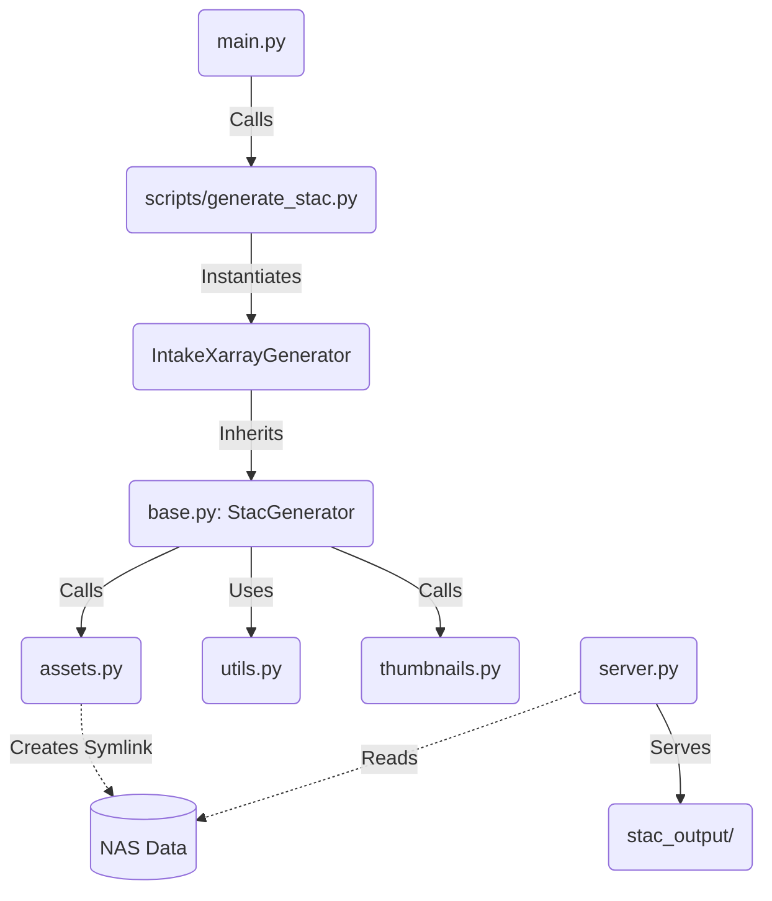

# Source Code Documentation (`src/`)

This directory contains the core application logic for the STAC Catalog Generator and Server.

## Directory Structure

### 1. Root Modules
- **`main.py`**: The CLI entrypoint. Uses `typer` to parse commands like `build` and `serve`. Orchestrates the overall workflow.
- **`server.py`**: A FastAPI application that serves:
    1. The Static Website (`static/stac-browser/dist`).
    2. The Generated STAC Catalog (`stac_output/`).
    3. The Data Files (via local symlinks or direct mounting).

### 2. `generator/` (Core Logic)
This package handles the conversion of Intake Catalogs (YAML) into STAC JSON (Collection & Items).

- **`base.py`**: Contains `StacGenerator`, the abstract base class and orchestrator. It manages the lifecycle:
    - Load Source -> Extract Metadata -> Compute Extent -> Generate Items -> Write JSON.
- **`intake_xarray.py`**: The concrete implementation. It knows how to read `intake-xarray` sources and extract specific metadata (coords, time, variables).
- **`utils.py`**: Pure helper functions for date formatting, spatial extent calculation, and dimension extraction.
- **`thumbnails.py`**: Visualization logic. Uses `matplotlib` and `xarray` to generate PNG thumbnails from dataset variables.
- **`assets.py`**: Asset management.
    - Creates **Local Symlinks** to allow private NAS data to be served via HTTP.
    - Handles Example Notebooks copying and linking.

### 3. `client/`
- **`stac_client.py`**: (Optional) A Python client for interacting with the generated STAC API. *Currently minimal usage.*

## Architecture & Dependencies

The following diagram illustrates how the components interact during the generation process:

```


## Key Design Decisions
- **Symlink Strategy**: To keep data secure on the intranet, we do not copy TBs of data. Instead, we create lightweight symlinks in `stac_output/items/` that point to the real files on NAS. `server.py` serves these links transparently.
- **Static Generation**: The catalog is "Static STAC" (just JSON files), making it extremely fast and cache-friendly. It does not require a database.
