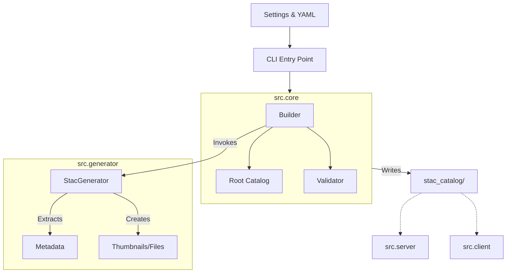

# Source Code Documentation

This directory contains the application logic, separated into distinct layers of responsibility. Each sub-module contains its own detailed `README.md`.

## Module Map

| Module | Responsibility | Documentation |
| :--- | :--- | :--- |
| **[Core](core/README.md)** | Orchestration, Grouping, & Validation | [Read More](core/README.md) |
| **[Generator](generator/README.md)** | ETL Logic, Metadata Extraction, & Asset Creation | [Read More](generator/README.md) |
| **[Server](server/README.md)** | HTTP Gateway & Static File Serving | [Read More](server/README.md) |
| **[Client](client/README.md)** | Python Interface for Users | [Read More](client/README.md) |

## High-Level Architecture

The application follows a linear control flow from Configuration -> CLI -> Core -> Generator -> Output.

## Directory Structure

- **`cli.py`**: Main entry point (`typer` app).
- **`settings.py`**: global configuration loader (`pystac`).
- **`core/`**: business logic for orchestration.
- **`generator/`**: implementation of the STAC generation logic.
- **`server/`**: web server implementation.
- **`client/`**: client library for users.

---

## Design Philosophy & Critical Assumptions

If you are contributing to this project, please understand the following core decisions that drive the architecture:

### 1. Configuration as Truth (The "No Database" Rule)
We do **not** use a database (PostgreSQL/Mongo) to store metadata. The **Intake YAML files** in `config/catalogs/*.yaml` are the single source of truth.
*   **Assumption**: Metadata updates happen via Git commits, not API calls.
*   **Implication**: The Generator must parse these YAMLs strictly. If fields are missing (like `catalog_name`), the build should fail early.

### 2. Static Generation (The "Serverless" Approach)
We generate **static JSON files** rather than running a dynamic STAC API service.
*   **Reasoning**: High performance, zero maintenance, and easy distribution (CDN/S3).
*   **Constraint**: Dynamic features (like "search by polygon") are handled client-side or by traversing the static links, not by backend SQL queries.

### 3. Virtual Data Access (The "Zero-Copy" Rule)
The generator does **not** copy the PB-scale Zarr files. It creates **Symlinks** or direct file references.
*   **Critical Assumption**: The code runs on the same NAS/Filesystem where the data resides. Docker containers must strictly map volumes to match the host paths.

### 4. Event-First Visualization
We prioritize **Event-Based Thumbnails** (e.g., specific typhoons) over statistical averages.
*   **Strategy**: The system prefers a specific timestamp (`thumbnail_datetime`) to showcase data quality during extreme events, rather than a muddy "mean" composite.

