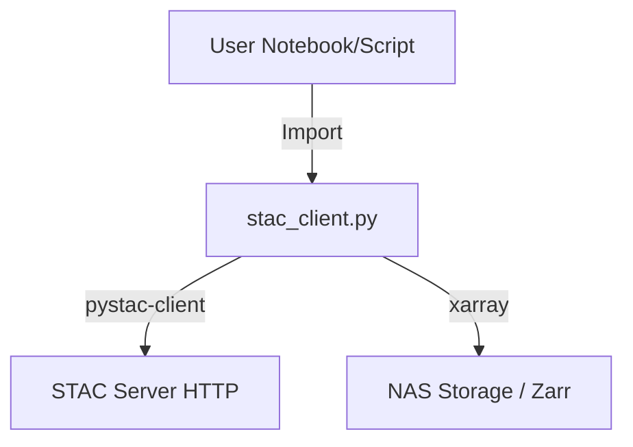

# Module: Client

## Module Description
The `client` module provides a Python-native interface for users to interact with the STAC Catalog. It abstracts the complexity of raw HTTP requests and URL handling, offering a convenient way to:
1.  Connect to the STAC server.
2.  Traverse Collections and Items.
3.  Load data directly into analysis workflows (e.g., opening Zarr stores).

## Architecture

## Dependencies

- **STAC Interaction**: `pystac_client`, `pystac`
- **Data Loading**: `intake`, `xarray` (implicitly via returned asset links)

## Local API Reference

### `stac_client.py`
- **`StacClient` (Class)**
    - **`__init__(url: str)`**: Initializes the connection to the STAC catalog URL.
    - **`get_collection(collection_id: str)`**: Retrieves a specific `pystac.Collection` object by ID.
    - **`search(collections=[...], datetime=...)`**: Performs a search query (if supported by the backend) or traverses the static catalog to find matching Items.
