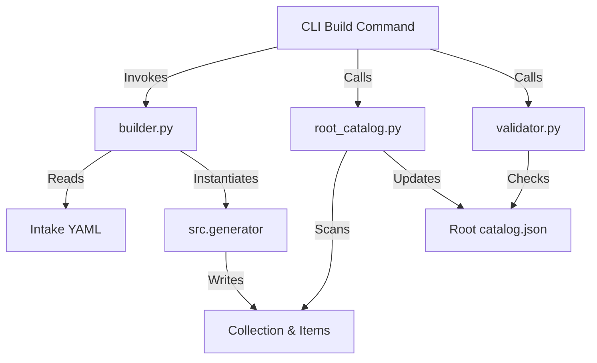

# Module: Core

## Module Description
The `core` module is the central orchestrator of the STAC generation process. It separates the "what" (Intake Configuration) from the "how" (Generation Logic). Its implementation focuses on:

1.  **Orchestration**: parsing Intake catalogs and initializing the appropriate Generators.
2.  **Organization**: Managing the hierarchical structure of the STAC Root Catalog (grouping, linking).
3.  **Validation**: Ensuring the generated output complies with STAC specifications.

## Architecture

The Core module sits between the CLI entry point and the specific Generators.

## Dependencies

- **External Libraries**:
    - `intake`: For reading catalog configurations.
    - `pystac`: For manipulating STAC objects.
    - `stac-validator`: For compliance checking.
- **Internal Modules**:
    - `src.generator`: Used by `builder.py` to perform the actual asset generation.

## Key Orchestration Logic

### 1. The "Clean Build" Strategy
The system is designed to run typically as a **Clean Build** (Regenerate everything).
*   **Reasoning**: Since the output is static JSON, attempting to "patch" individual items can lead to broken links or stale metadata. Regenerating the catalog ensures consistency.
*   **Performance**: Parallel processing in `builder.py` ensures this remains fast even for large catalogs.

### 2. Grouping by Directory (`root_catalog.py`)
The root catalog generation does **not** query a database to find collections.
*   **Logic**: It scans the `stac_catalog/` directory on disk.
*   **Grouping Rule**: Subdirectories (e.g., `stac_catalog/imerg/`) are treated as **Group Catalogs**. The presence of a `catalog.json` in a subdirectory triggers the creation of a Child Link in the Root Catalog.
*   **Title/Casing**: The specific casing for the Group Title (e.g. "IMERG" vs "imerg") is recovered from the Child Catalog's `extra_fields` (which were persisted from the Intake YAML during generation).

## Local API Reference

### `builder.py`
- **`build_collection(catalog_path: Path, source_id: str, output_dir: Path)`**
    - **Description**: The primary entry point for the build process. It opens the specified Intake catalog, retrieves the source, and runs the `IntakeXarrayGenerator` to produce STAC metadata.

### `root_catalog.py`
- **`update_root_catalog(stac_output_dir: Path, ...)`**
    - **Description**: Managing the top-level `catalog.json`. It scans all generated collections, groups them based on their `group_id` (from Intake metadata), and regenerates the root structure and links.

### `validator.py`
- **`validate_catalog(catalog_path: Path)`**
    - **Description**: A wrapper around `stac-validator`. It recursively validates the entire catalog starting from the given path and logs any errors.
