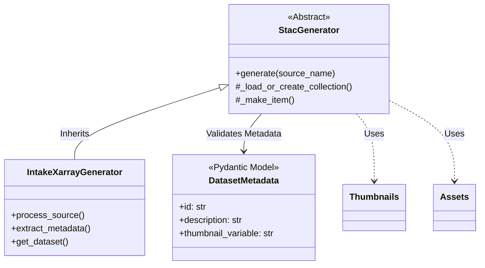

# Module: Generator

## Module Description
The `generator` module encapsulates the core business logic for converting raw data sources into STAC specifications. It follows a **Template Method** pattern where the abstract base class defines the workflow, and concrete implementations handle specific data source types (e.g., Intake-Xarray).

**Responsibilities:**
1.  **Metadata Abstraction**: extracting unified metadata from diverse sources.
2.  **Validation**: Enforcing schema requirements via Pydantic models.
3.  **Asset Creation**: Generating derivative assets like thumbnails and linking example notebooks.
4.  **STAC Generation**: Creating `Collection` and `Item` objects with calculated spatial/temporal extents.

## Architecture

## Dependencies

- **Data Processing**: `xarray`, `pandas`, `numpy`, `cf_xarray`
- **STAC**: `pystac`, `xstac`
- **Visualization**: `matplotlib`
- **Internal**: `src.generator.model` (Schema definition)

## Key Assumptions & Design

### 1. Tiered Metadata Structure
The generator assumes Intake YAMLs are structured in 4 tiers. This is **critical** for correct STAC mapping:
*   **Core Identity**: `id`, `category` (Required for valid STAC Item).
*   **Display**: `description`, `thumbnail_variable` (Used for UI).
*   **Scientific**: `sci:citation`, `platform` (Mapped to STAC Extensions).
*   **Providers**: `providers` list (Mapped to STAC Provider objects).

### 2. Strict Validation (`model.py`)
We use Pydantic models to parse Intake metadata.
*   **Why?** To catch configuration errors early (e.g., missing ID) rather than generating broken STAC catalogs.
*   **Dev Note**: If you add a new field to Intake YAML, you **must** add it to `DatasetMetadata` in `model.py` or it will be ignored (or raise an error depending on config).

### 3. Event-Centric Thumbnails (`thumbnails.py`)
The generator is designed to select a specific timestamp (`target_datetime`) for thumbnails.
*   **Assumption**: Weather datasets are best represented by specific events (Typhoons, Fronts) rather than average conditions.
*   **Logic**: If `thumbnail_datetime` is provided in YAML, we use Nearest Neighbor lookup. If missing, we fallback to the middle timestep.

## Local API Reference

### `base.py`
- **`StacGenerator` (Class)**
    - **Description**: The abstract base class that defines the generation lifecycle.
    - **Key Methods**:
        - `generate(source_name: str)`: The main driver method.
        - `_load_or_create_collection(...)`: Manages the parent Collection creation.
        - `_make_item(...)`: Creates individual STAC Items for each time slice (e.g., yearly).

### `intake_xarray.py`
- **`IntakeXarrayGenerator` (Class)**
    - **Description**: Concrete implementation for sources defined in Intake catalogs via Xarray.
    - **Key Methods**:
        - `extract_metadata(source)`: Normalizes the raw Intake metadata into a dictionary matching `DatasetMetadata`.
        - `get_dataset(source)`: Returns a lazy `xarray.Dataset` (using Dask) for processing.

### `model.py`
- **`DatasetMetadata` (Class)**
    - **Description**: A Pydantic model that acts as the source of truth for metadata validation. It defines all supported fields (Standard STAC + Custom extensions like `thumbnail_datetime`).

### `thumbnails.py`
- **`generate_thumbnail(...)`**
    - **Description**: Generates PNG thumbnails from Xarray datasets.
    - **Features**: Supports finding the nearest time slice to a target event (`target_datetime`) or falling back to the middle timestep.

### `assets.py`
- **`create_data_asset(...)`**
    - **Description**: Helper to create `pystac.Asset` objects pointing to the physical Zarr data.
    - **`process_example_notebook(...)`**: Converst and embeds example Jupyter notebooks as assets.
