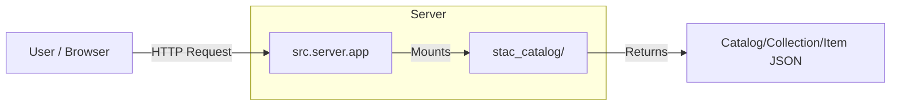

# Module: Server

## Module Description
The `server` module acts as the HTTP gateway for the generated STAC Catalog. While the catalog itself is static (files on disk), the server enables standard HTTP access, allowing it to be consumed by:
1.  **STAC Browser**: For visual exploration.
2.  **API Clients**: For programmatic access (e.g., `pystac-client`).

It is built on **FastAPI** for high performance and easy static file serving.

## Architecture

## Dependencies

- **Framework**: `fastapi`
- **Server**: `uvicorn` (ASGI Server)

## Local API Reference

### `app.py`
- **`serve_catalog()`**
    - **Description**: Configures the FastAPI app to serve the `stac_catalog` directory as a static file mount. This mimics a basic STAC API by exposing the raw JSON structure over HTTP.
